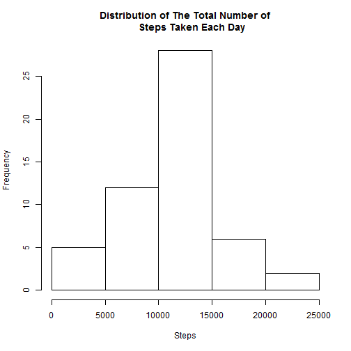
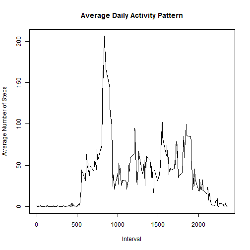
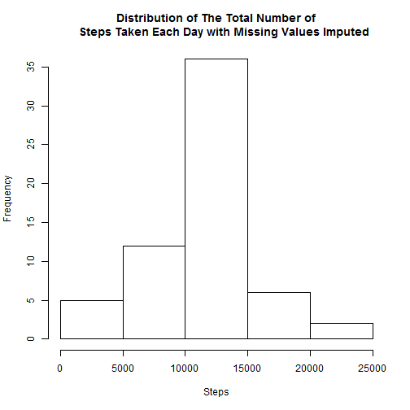
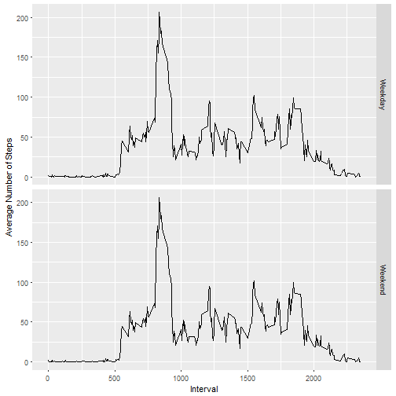

Reproducible Research Project 1
===============================


#Loading and preprocessing data

```r
library(dplyr)
library(ggplot2)
download.file(url = "https://d396qusza40orc.cloudfront.net/repdata%2Fdata%2Factivity.zip",
              destfile = "raw_data.zip")
unzip("raw_data.zip")
data <- read.csv("activity.csv", na.strings = "NA")
str(data)
```

```
## 'data.frame':	17568 obs. of  3 variables:
##  $ steps   : int  NA NA NA NA NA NA NA NA NA NA ...
##  $ date    : Factor w/ 61 levels "2012-10-01","2012-10-02",..: 1 1 1 1 1 1 1 1 1 1 ...
##  $ interval: int  0 5 10 15 20 25 30 35 40 45 ...
```

```r
#Convert date from a factor to a date
data$date <- as.Date(data$date, format = "%Y-%m-%d")
```

#What is the mean total number of steps taken per day

```r
#First, calculate the total number of steps per day and store in total dataframe
total <- data %>%
         group_by(date) %>%
         summarise(tot = sum(steps)) %>%
         na.omit()

hist(total$tot, xlab = "Steps", main = "Distribution of The Total Number of
     Steps Taken Each Day")
```



```r
#Mean number of steps per day:
mean(total$tot)
```

```
## [1] 10766.19
```

```r
#Median number of steps per day:
median(total$tot)
```

```
## [1] 10765
```

#What is the average daily activity pattern

```r
interval <- data %>%
            group_by(interval) %>%
            na.omit(steps) %>%
            summarise(avg = mean(steps))

plot(interval$interval, interval$avg, type = "l",
        main = "Average Daily Activity Pattern",
        xlab = "Interval", ylab = "Average Number of Steps")
```



```r
#5 minute interval with the maximum number of average steps
max(interval$avg)
```

```
## [1] 206.1698
```

#Imputing missing values

```r
#Number of rows with missing values:
sum(is.na(data))
```

```
## [1] 2304
```

```r
#Fill in the missing data with the mean number of steps taken for each interval
fill <- merge(data, interval, by = "interval")
fill$steps <- ifelse(is.na(fill$steps), fill$avg, fill$steps)

total_na_filled <- fill %>%
                        group_by(date) %>%
                        summarise(total = sum(steps))

hist(total_na_filled$total, xlab = "Steps", main = "Distribution of The Total Number of
     Steps Taken Each Day with Missing Values Imputed")
```



```r
#Averge of the total number of steps per day with imputed values:
mean(total_na_filled$total)
```

```
## [1] 10766.19
```

```r
#Median of the total number of steps per day with imputed values:
median(total_na_filled$total)
```

```
## [1] 10766.19
```

Using the mean for each interval for imputation does not change the mean
when calculated without imputation (specifically, omitting the missing values). The median, however, is now equal to the mean.

#Weekdays vs. Weekends

```r
fill$date <- as.Date(fill$date, format = "%Y-%m-%d")
fill$weekday <- as.factor(ifelse(weekdays(fill$date) == "Saturday" | weekdays(fill$date) == 
                        "Sunday", "Weekend", "Weekday"))

ggplot(fill, aes(x = interval, y = avg)) +
        geom_line() +
        facet_grid(weekday ~ .) +
        ylab(label = "Average Number of Steps") +
        xlab(label = "Interval")
```


There is very little, if any, difference in the average number of steps taken on the weekends and weekdays, at least as the data has been calculated here. 
